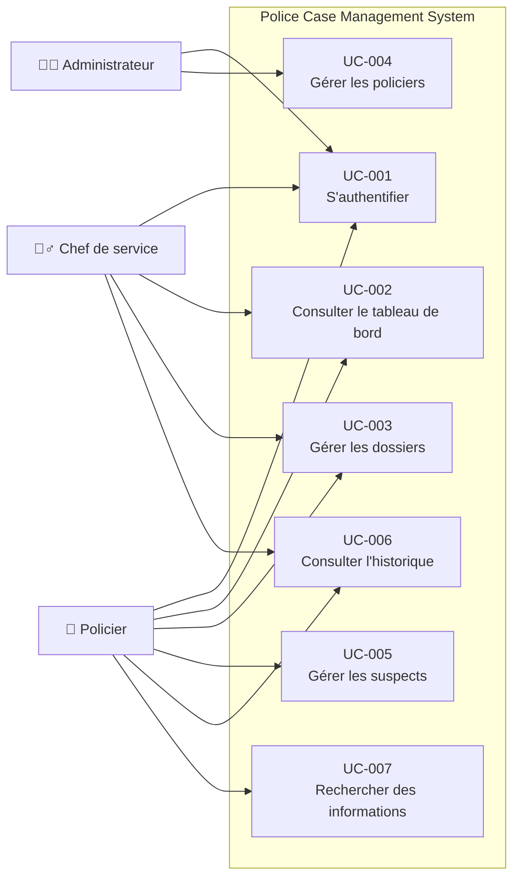

# 04 - Use Cases

---

| Élément                  | Valeur                               |
| ------------------------ | ------------------------------------ |
| **Document**             | 04-Use-Cases.md                      |
| **Projet**               | Police Case Management System (PCMS) |
| **Version**              | 1.0.0                                |
| **Statut**               | Draft                                |
| **Auteur**               | Équipe Projet PCMS                   |
| **Dernière mise à jour** | 29/07/2026                           |

---

# Table des matières

1. Objectif
2. Vue d'ensemble
3. Acteurs
4. Diagramme global des cas d'utilisation
5. Catalogue des cas d'utilisation
6. Matrice Acteurs / Cas d'utilisation
7. Traçabilité
8. Documents associés
9. Historique des révisions

---

# 1. Objectif

Ce document décrit les principaux cas d'utilisation du **Police Case Management System (PCMS)**.

Les cas d'utilisation représentent les interactions entre les utilisateurs et le système afin de satisfaire les besoins métier identifiés dans les documents précédents.

Ils servent de référence pour :

* la conception fonctionnelle ;
* le développement ;
* les tests fonctionnels ;
* la validation métier.

---

# 2. Vue d'ensemble

Le PCMS permet aux utilisateurs autorisés de :

* s'authentifier ;
* consulter un tableau de bord ;
* gérer les dossiers de police ;
* gérer les policiers ;
* gérer les suspects ;
* consulter l'historique des actions ;
* effectuer des recherches.

Toutes les interactions avec les données passent par le système PCMS.

---

# 3. Acteurs

## Policier (Officer)

Le policier est l'utilisateur principal du système.

Il est chargé de :

* créer des dossiers ;
* consulter des dossiers ;
* modifier des dossiers ;
* rechercher des informations ;
* consulter l'historique.

---

## Chef de service (Supervisor)

Le chef de service supervise l'activité de son unité.

Il consulte notamment :

* les dossiers ;
* les tableaux de bord ;
* les indicateurs d'activité.

---

## Administrateur (Administrator)

L'administrateur est responsable de l'administration de l'application.

Il gère :

* les utilisateurs ;
* les rôles ;
* la configuration générale.

---

# 4. Diagramme global des cas d'utilisation

---

# 5. Catalogue des cas d'utilisation

---

## UC-001 — S'authentifier

### Objectif

Permettre à un utilisateur autorisé d'accéder au système.

### Acteurs

* Policier
* Chef de service
* Administrateur

### Préconditions

* L'utilisateur possède un compte valide.

### Résultat attendu

* L'utilisateur accède aux fonctionnalités autorisées selon son rôle.

---

## UC-002 — Consulter le tableau de bord

### Objectif

Afficher une vue synthétique de l'activité du système.

### Acteurs

* Policier
* Chef de service

### Informations affichées

* nombre de dossiers ;
* nombre de policiers ;
* nombre de suspects ;
* dernières activités ;
* graphiques.

---

## UC-003 — Gérer les dossiers

### Objectif

Permettre la gestion complète des dossiers de police.

### Acteurs

* Policier
* Chef de service

### Actions

* créer ;
* consulter ;
* modifier ;
* supprimer ;
* rechercher ;
* filtrer.

Chaque modification génère automatiquement une entrée dans l'historique.

---

## UC-004 — Gérer les policiers

### Objectif

Administrer les informations relatives aux policiers.

### Acteur

* Administrateur

### Actions

* créer ;
* consulter ;
* modifier ;
* supprimer.

---

## UC-005 — Gérer les suspects

### Objectif

Administrer les informations relatives aux suspects.

### Acteur

* Policier

### Actions

* créer ;
* consulter ;
* modifier ;
* supprimer.

---

## UC-006 — Consulter l'historique

### Objectif

Consulter les opérations réalisées sur les dossiers.

### Acteurs

* Policier
* Chef de service

### Informations disponibles

* utilisateur ;
* action réalisée ;
* dossier concerné ;
* date de l'opération.

---

## UC-007 — Rechercher des informations

### Objectif

Permettre la recherche rapide des informations enregistrées.

### Acteur

* Policier

### Fonctionnalités

* recherche ;
* filtrage.

---

# 6. Matrice Acteurs / Cas d'utilisation

| Cas d'utilisation            | Policier | Chef de service | Administrateur |
| ---------------------------- | :------: | :-------------: | :------------: |
| UC-001 Authentification      |     ✓    |        ✓        |        ✓       |
| UC-002 Tableau de bord       |     ✓    |        ✓        |                |
| UC-003 Gestion des dossiers  |     ✓    |        ✓        |                |
| UC-004 Gestion des policiers |          |                 |        ✓       |
| UC-005 Gestion des suspects  |     ✓    |                 |                |
| UC-006 Historique            |     ✓    |        ✓        |                |
| UC-007 Recherche             |     ✓    |                 |                |

---

# 7. Traçabilité

| Cas d'utilisation | Business Requirement | Business Rule    |
| ----------------- | -------------------- | ---------------- |
| UC-001            | BR-001               | BRU-001          |
| UC-002            | BR-003               | BRU-008          |
| UC-003            | BR-004               | BRU-003          |
| UC-004            | BR-005               | BRU-004          |
| UC-005            | BR-006               | BRU-005          |
| UC-006            | BR-007               | BRU-006, BRU-007 |
| UC-007            | BR-008               | BRU-009          |

---

# 8. Documents associés

* README.md
* 01-Introduction.md
* 02-Business-Requirements.md
* 03-Business-Rules.md
* 05-System-Architecture.md
* 06-C4-Context.md

---

# 9. Historique des révisions

| Version | Date       | Auteur             | Description          |
| ------- | ---------- | ------------------ | -------------------- |
| 1.0.0   | 29/07/2026 | Équipe Projet PCMS | Création du document |

