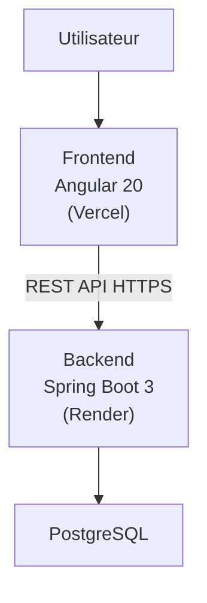

# 05 - System Architecture

---

| Élément                  | Valeur                               |
| ------------------------ | ------------------------------------ |
| **Document**             | 05-System-Architecture.md            |
| **Projet**               | Police Case Management System (PCMS) |
| **Version**              | 1.0.0                                |
| **Statut**               | Draft                                |
| **Auteur**               | Équipe Projet PCMS                   |
| **Dernière mise à jour** | 29/07/2026                           |

---

# Table des matières

1. Objectif
2. Vue d'ensemble
3. Objectifs d'architecture
4. Principes d'architecture
5. Architecture logique
6. Architecture physique
7. Stack technique
8. Flux de communication
9. Qualités architecturales
10. Contraintes techniques
11. Évolutions prévues
12. Documents associés
13. Historique des révisions

---

# 1. Objectif

Ce document présente l'architecture générale du **Police Case Management System (PCMS)**.

Il décrit les principaux composants du système, leurs responsabilités ainsi que les principes ayant guidé les choix d'architecture.

Les diagrammes détaillés (C4 Niveau 1, 2 et 3) sont documentés dans les chapitres suivants.

---

# 2. Vue d'ensemble

Le PCMS est une application Web moderne reposant sur une architecture distribuée composée de plusieurs couches clairement séparées :

* une interface utilisateur (Frontend) ;
* une API REST (Backend) ;
* une base de données relationnelle ;
* des composants techniques dédiés au déploiement et à la gestion de l'infrastructure.

Cette séparation permet d'améliorer la maintenabilité, la sécurité et l'évolutivité de la solution.

---

# 3. Objectifs d'architecture

L'architecture du PCMS poursuit les objectifs suivants :

* séparer les responsabilités entre les différentes couches ;
* faciliter les évolutions futures ;
* garantir la maintenabilité du code ;
* permettre le déploiement indépendant des composants ;
* sécuriser les échanges entre les applications ;
* favoriser les bonnes pratiques de développement.

---

# 4. Principes d'architecture

Le projet repose sur les principes suivants :

## Modularité

Chaque composant possède une responsabilité clairement définie.

---

## Séparation des responsabilités

Le frontend est responsable de la présentation.

Le backend porte la logique métier et expose une API REST.

La base de données assure la persistance des informations.

---

## Évolutivité

L'architecture prévoit l'intégration future de services externes tels que :

* IAM / SSO ;
* stockage de fichiers ;
* service de messagerie ;
* journalisation centralisée.

---

## Maintenabilité

Chaque couche peut évoluer indépendamment dans le respect des interfaces définies.

---

# 5. Architecture logique

Le système est constitué des composants principaux suivants.

## Frontend

Responsabilités :

* interface utilisateur ;
* navigation ;
* appels REST ;
* gestion de l'état de l'application.

Technologies :

* Angular 20
* TypeScript
* Angular Material
* RxJS
* Signals

---

## Backend

Responsabilités :

* logique métier ;
* sécurité ;
* validation ;
* accès aux données ;
* exposition de l'API REST.

Technologies :

* Java 21
* Spring Boot 3
* Spring Security
* JWT
* MapStruct
* Flyway

---

## Base de données

Responsabilités :

* stockage des données ;
* gestion des relations ;
* intégrité des informations.

Technologie :

* PostgreSQL

---

# 6. Architecture physique

---

# 7. Stack technique

## Frontend

| Technologie      | Utilisation            |
| ---------------- | ---------------------- |
| Angular 20       | Interface utilisateur  |
| TypeScript       | Développement          |
| Angular Material | Composants UI          |
| RxJS             | Programmation réactive |
| Signals          | Gestion de l'état      |

---

## Backend

| Technologie     | Utilisation      |
| --------------- | ---------------- |
| Java 21         | Langage          |
| Spring Boot 3   | Framework        |
| Spring Security | Sécurité         |
| JWT             | Authentification |
| MapStruct       | Mapping DTO      |
| Flyway          | Migrations       |

---

## Base de données

| Technologie | Utilisation             |
| ----------- | ----------------------- |
| PostgreSQL  | Persistance des données |

---

## Déploiement

| Technologie | Utilisation          |
| ----------- | -------------------- |
| Docker      | Conteneurisation     |
| Vercel      | Hébergement Frontend |
| Render      | Hébergement Backend  |

---

# 8. Flux de communication

Le fonctionnement général du système est le suivant :

1. L'utilisateur accède au frontend Angular.
2. Le frontend envoie des requêtes HTTPS vers l'API REST.
3. Le backend applique les règles métier.
4. Le backend interroge PostgreSQL.
5. Les résultats sont renvoyés au frontend.
6. Le frontend met à jour l'interface utilisateur.

Toutes les communications entre le frontend et le backend utilisent une API REST sécurisée.

---

# 9. Qualités architecturales

L'architecture vise les qualités suivantes :

| Qualité         | Description                            |
| --------------- | -------------------------------------- |
| Modularité      | Composants indépendants                |
| Maintenabilité  | Séparation des responsabilités         |
| Évolutivité     | Ajout de nouveaux services             |
| Sécurité        | Authentification et contrôle des accès |
| Lisibilité      | Architecture claire                    |
| Réutilisabilité | Composants spécialisés                 |

---

# 10. Contraintes techniques

Le projet utilise les technologies suivantes :

* Angular 20 ;
* Java 21 ;
* Spring Boot 3 ;
* PostgreSQL ;
* Docker.

L'ensemble des composants communique via une API REST sécurisée.

---

# 11. Évolutions prévues

L'architecture a été pensée afin de faciliter l'intégration future de nouveaux services.

Les évolutions identifiées sont notamment :

* fournisseur IAM / SSO ;
* stockage externe des pièces jointes ;
* service de messagerie ;
* journalisation centralisée.

Ces composants seront progressivement intégrés sans remettre en cause l'architecture générale.

---

# 12. Documents associés

| Document            | Description                        |
| ------------------- | ---------------------------------- |
| README.md           | Présentation générale              |
| 04-Use-Cases.md     | Cas d'utilisation                  |
| 06-C4-Context.md    | Diagramme de contexte              |
| 07-C4-Containers.md | Diagramme des conteneurs           |
| 08-C4-Components.md | Diagramme des composants           |
| 09-Database.md      | Architecture de la base de données |
| 10-Backend.md       | Architecture backend               |
| 11-Frontend.md      | Architecture frontend              |

---

# 13. Historique des révisions

| Version | Date       | Auteur             | Description          |
| ------- | ---------- | ------------------ | -------------------- |
| 1.0.0   | 29/07/2026 | Équipe Projet PCMS | Création du document |

