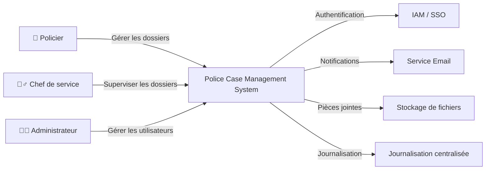

# 06 - C4 Context Diagram (Level 1)

---

| Élément                  | Valeur                               |
| ------------------------ | ------------------------------------ |
| **Document**             | 06-C4-Context.md                     |
| **Projet**               | Police Case Management System (PCMS) |
| **Version**              | 1.0.0                                |
| **Statut**               | Draft                                |
| **Auteur**               | Équipe Projet PCMS                   |
| **Dernière mise à jour** | 29/07/2026                           |

---

# Table des matières

1. Objectif
2. Le modèle C4
3. Objectifs du diagramme de contexte
4. Périmètre du système
5. Acteurs
6. Systèmes externes
7. Diagramme C4 – Niveau 1
8. Description des interactions
9. Principes d'architecture
10. Limites du diagramme
11. Documents associés
12. Historique des révisions

---

# 1. Objectif

Ce document présente le **diagramme de contexte (C4 – Niveau 1)** du **Police Case Management System (PCMS)**.

Le diagramme de contexte constitue le premier niveau du modèle C4. Il permet de représenter le système dans son environnement en identifiant :

* les utilisateurs ;
* le système principal ;
* les systèmes externes ;
* les interactions entre ces éléments.

Il fournit une vision globale de l'application sans entrer dans les détails techniques de son implémentation.

---

# 2. Le modèle C4

Le **C4 Model**, créé par **Simon Brown**, est une méthode de documentation d'architecture logicielle permettant de décrire un système selon différents niveaux de détail.

Les quatre niveaux sont les suivants :

| Niveau | Nom                | Objectif                                                  |
| ------ | ------------------ | --------------------------------------------------------- |
| C1     | Context            | Présenter le système dans son environnement               |
| C2     | Containers         | Décrire les principales applications composant le système |
| C3     | Components         | Détailler les composants internes des applications        |
| C4     | Code *(optionnel)* | Représenter les principaux modules ou classes             |

Le présent document couvre exclusivement le **niveau C1**.

---

# 3. Objectifs du diagramme de contexte

Le diagramme de contexte répond à la question suivante :

> **Qui utilise le système et avec quels systèmes externes communique-t-il ?**

Il permet :

* d'identifier les utilisateurs ;
* de délimiter le périmètre du PCMS ;
* de mettre en évidence les interactions avec les systèmes externes ;
* de préparer les niveaux C2 et C3 de la documentation d'architecture.

---

# 4. Périmètre du système

Le **Police Case Management System (PCMS)** est l'application centrale.

Il assure notamment :

* la gestion des dossiers ;
* la gestion des suspects ;
* la gestion des policiers ;
* l'historisation des actions ;
* la consultation des tableaux de bord.

Toutes les interactions passent par cette application.

La base de données, les API internes et les composants techniques ne sont volontairement pas représentés dans ce diagramme, car ils relèvent des niveaux C2 et C3.

---

# 5. Acteurs

## 👮 Policier

Le policier est le principal utilisateur du système.

Il peut :

* créer des dossiers ;
* consulter des dossiers ;
* modifier des dossiers.

---

## 👮‍♂️ Chef de service

Le chef de service supervise les dossiers de son unité.

Il consulte principalement :

* les dossiers ;
* les tableaux de bord ;
* les indicateurs d'activité.

---

## 👨‍💼 Administrateur

L'administrateur assure la gestion technique de l'application.

Il est responsable :

* des utilisateurs ;
* des rôles ;
* des paramètres de l'application.

---

# 6. Systèmes externes

Même si certains ne sont pas encore implémentés dans la première version du projet, ils sont représentés afin de montrer que l'architecture a été pensée pour évoluer.

| Système externe            | Rôle                                              |
| -------------------------- | ------------------------------------------------- |
| IAM / SSO                  | Authentification centralisée (évolution future)   |
| Service Email              | Notifications et réinitialisation de mot de passe |
| Stockage de fichiers       | Conservation des pièces jointes                   |
| Journalisation centralisée | Centralisation des journaux et événements         |

---

# 7. Diagramme C4 – Niveau 1

---

# 8. Description des interactions

## Authentification

Le PCMS authentifie les utilisateurs.

Dans la première version, l'authentification est assurée par **Spring Security** et **JWT**.

L'architecture prévoit une évolution vers une solution IAM / SSO compatible OpenID Connect.

---

## Notifications

Le service de messagerie est destiné à :

* envoyer des notifications ;
* permettre la réinitialisation des mots de passe ;
* informer les utilisateurs de certains événements.

---

## Stockage des pièces jointes

Les documents associés aux dossiers (rapports, photographies, fichiers PDF, etc.) sont destinés à être stockés dans un service dédié, distinct de la base de données relationnelle.

---

## Journalisation

Le système prévoit une journalisation centralisée des événements et des erreurs.

Cette architecture permettra, à terme, l'intégration de solutions telles que Grafana, Loki ou ELK.

---

# 9. Principes d'architecture

Le diagramme met en évidence plusieurs principes architecturaux :

## Centralisation

Toutes les interactions passent par le PCMS.

---

## Séparation des responsabilités

Les services externes sont indépendants de l'application principale.

---

## Évolutivité

Les intégrations futures peuvent être ajoutées sans remettre en cause le fonctionnement général du système.

---

## Maintenabilité

Les responsabilités sont clairement réparties entre les différents acteurs et systèmes.

---

# 10. Limites du diagramme

Le diagramme de contexte ne représente pas :

* les conteneurs logiciels ;
* les composants internes ;
* la base de données ;
* les API internes ;
* les classes Java ;
* les composants Angular.

Ces éléments seront décrits dans les documents suivants :

* **07-C4-Containers.md**
* **08-C4-Components.md**

---

# 11. Documents associés

| Document                  | Description                        |
| ------------------------- | ---------------------------------- |
| 05-System-Architecture.md | Architecture générale              |
| 07-C4-Containers.md       | C4 – Niveau 2                      |
| 08-C4-Components.md       | C4 – Niveau 3                      |
| 09-Database.md            | Architecture de la base de données |
| 10-Backend.md             | Architecture backend               |
| 11-Frontend.md            | Architecture frontend              |
| 12-Security.md            | Architecture de sécurité           |

---

# 12. Historique des révisions

| Version | Date       | Auteur             | Description          |
| ------- | ---------- | ------------------ | -------------------- |
| 1.0.0   | 29/07/2026 | Équipe Projet PCMS | Création du document |

