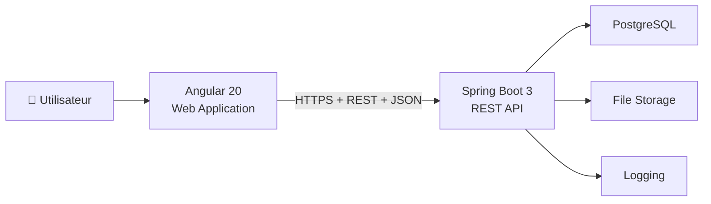

# 07 - C4 Containers Diagram (Level 2)

---

| Élément                  | Valeur                               |
| ------------------------ | ------------------------------------ |
| **Document**             | 07-C4-Containers.md                  |
| **Projet**               | Police Case Management System (PCMS) |
| **Version**              | 1.0.0                                |
| **Statut**               | Draft                                |
| **Auteur**               | Équipe Projet PCMS                   |
| **Dernière mise à jour** | 29/07/2026                           |

---

# Table des matières

1. Objectif
2. Le niveau C2 du modèle C4
3. Qu'est-ce qu'un Container ?
4. Conteneurs du système
5. Diagramme C4 – Niveau 2
6. Description des conteneurs
7. Communication entre les conteneurs
8. Principes d'architecture
9. Avantages de l'architecture retenue
10. Correspondance avec les exigences du projet
11. Documents associés
12. Historique des révisions

---

# 1. Objectif

Ce document décrit le **diagramme C4 – Niveau 2 (Container Diagram)** du **Police Case Management System (PCMS)**.

Le diagramme présente les principales applications et services composant le système, leurs responsabilités ainsi que leurs interactions.

Il constitue le lien entre :

* le diagramme de contexte (C4 – Niveau 1) ;
* la conception détaillée des composants (C4 – Niveau 3).

---

# 2. Le niveau C2 du modèle C4

Le niveau **Containers** du modèle C4 décrit les applications, services et bases de données qui composent un système logiciel.

Chaque conteneur possède une responsabilité clairement définie et communique avec les autres au travers d'interfaces identifiées.

> **Important :** Un *Container* au sens du modèle C4 ne correspond pas à un conteneur Docker. Il représente une application exécutable ou un service logique. Docker est uniquement une technologie de déploiement.

---

# 3. Qu'est-ce qu'un Container ?

Dans le contexte du modèle C4, un conteneur peut être :

* une application Angular ;
* une API Spring Boot ;
* une base de données PostgreSQL ;
* un service de stockage de fichiers ;
* un serveur d'authentification.

Chaque conteneur est autonome, possède une responsabilité propre et peut évoluer indépendamment des autres.

---

# 4. Conteneurs du système

La première version (MVP) du PCMS est composée des conteneurs suivants :

| Conteneur           | Technologie                                              | Responsabilité                                                       |
| ------------------- | -------------------------------------------------------- | -------------------------------------------------------------------- |
| **Web Application** | Angular 20                                               | Interface utilisateur et interactions côté client                    |
| **REST API**        | Spring Boot 3 (Java 21)                                  | Logique métier, sécurité et exposition des services REST             |
| **Database**        | PostgreSQL                                               | Persistance des données                                              |
| **File Storage**    | Object Storage / File System                             | Stockage des pièces jointes et documents d'enquête                   |
| **Authentication**  | Spring Security + JWT                                    | Authentification des utilisateurs *(intégrée au backend dans la V1)* |
| **Logging**         | Spring Boot Actuator *(évolution future : Grafana/Loki)* | Journalisation, supervision et audit                                 |

> Dans la version actuelle, le composant d'authentification est intégré à la REST API. Une évolution vers un fournisseur IAM externe (Keycloak, Azure AD, etc.) est prévue.

---

# 5. Diagramme C4 – Niveau 2

---

# 6. Description des conteneurs

## 6.1 Web Application (Angular)

### Responsabilités

* affichage de l'interface utilisateur ;
* navigation ;
* formulaires ;
* appels REST ;
* gestion du JWT côté client ;
* validation côté client ;
* expérience utilisateur.

Le frontend ne contient **aucune logique métier**. Toute la logique métier est implémentée côté serveur.

---

## 6.2 REST API (Spring Boot)

### Responsabilités

* authentification ;
* autorisation ;
* validation des données ;
* application des règles métier ;
* contrôle des accès ;
* exposition de l'API REST ;
* accès à la base de données ;
* journalisation.

La REST API constitue le cœur de l'application.

---

## 6.3 Base de données (PostgreSQL)

### Responsabilités

* stockage relationnel ;
* gestion des transactions ;
* contraintes d'intégrité ;
* indexation.

La base de données ne contient aucune logique métier.

---

## 6.4 File Storage

Le stockage des pièces jointes est séparé de la base de données relationnelle.

Il est destiné à conserver notamment :

* les photographies ;
* les documents PDF ;
* les pièces jointes des enquêtes.

Cette séparation améliore les performances et facilite l'évolution de l'architecture.

---

## 6.5 Logging

Le système centralise les journaux d'application afin de faciliter :

* le diagnostic des incidents ;
* le suivi des erreurs ;
* l'audit des opérations ;
* la supervision.

Des solutions telles que **Grafana** ou **Loki** pourront être intégrées dans les versions futures.

---

# 7. Communication entre les conteneurs

Le flux principal est le suivant :

1. L'utilisateur interagit avec l'application Angular.
2. Angular communique avec la REST API via HTTPS et des échanges JSON.
3. La REST API applique les règles métier.
4. Les données sont lues ou enregistrées dans PostgreSQL.
5. Les pièces jointes sont stockées dans le service de stockage.
6. Les événements et erreurs sont enregistrés dans le système de journalisation.

---

# 8. Principes d'architecture

L'architecture du PCMS respecte les principes suivants :

* séparation des responsabilités ;
* faible couplage (*Low Coupling*) ;
* forte cohésion (*High Cohesion*) ;
* évolutivité (*Scalability*) ;
* maintenabilité (*Maintainability*) ;
* testabilité (*Testability*).

---

# 9. Avantages de l'architecture retenue

La séparation entre le frontend et le backend offre plusieurs avantages :

* déploiement indépendant des applications ;
* maintenance simplifiée ;
* possibilité de développer d'autres clients (mobile, systèmes tiers) ;
* meilleure scalabilité ;
* tests indépendants des différentes couches ;
* diffusion du frontend via un CDN.

L'utilisation d'une API REST favorise également l'intégration avec d'autres systèmes et la génération automatique d'une documentation OpenAPI.

---

# 10. Correspondance avec les exigences du projet

| Exigence                      | Choix d'architecture                            |
| ----------------------------- | ----------------------------------------------- |
| Architecture modulaire        | Séparation Frontend / Backend / Base de données |
| API REST                      | Spring Boot + JSON + HTTPS                      |
| Interface Web                 | Angular 20                                      |
| Base de données relationnelle | PostgreSQL                                      |
| Déploiement                   | Docker                                          |
| Intégration de systèmes       | API REST indépendante                           |
| Documentation                 | Modèle C4 + Markdown                            |

---

# 11. Documents associés

| Document                  | Description                              |
| ------------------------- | ---------------------------------------- |
| 05-System-Architecture.md | Architecture générale                    |
| 06-C4-Context.md          | Diagramme de contexte (C4 – Niveau 1)    |
| 08-C4-Components.md       | Diagramme des composants (C4 – Niveau 3) |
| 09-Database.md            | Architecture de la base de données       |
| 10-Backend.md             | Architecture du backend                  |
| 11-Frontend.md            | Architecture du frontend                 |

---

# 12. Historique des révisions

| Version | Date       | Auteur             | Description          |
| ------- | ---------- | ------------------ | -------------------- |
| 1.0.0   | 29/07/2026 | Équipe Projet PCMS | Création du document |

