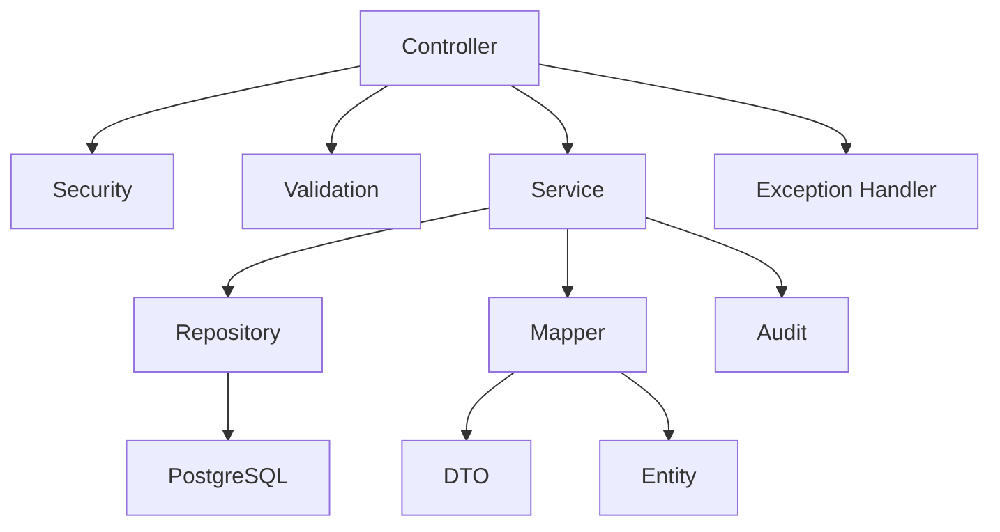

# 08 - C4 Components Diagram (Level 3)

---

| Élément                  | Valeur                               |
| ------------------------ | ------------------------------------ |
| **Document**             | 08-C4-Components.md                  |
| **Projet**               | Police Case Management System (PCMS) |
| **Version**              | 1.0.0                                |
| **Statut**               | Draft                                |
| **Auteur**               | Équipe Projet PCMS                   |
| **Dernière mise à jour** | 29/07/2026                           |

---

# Table des matières

1. Objectif
2. Le niveau C3 du modèle C4
3. Périmètre
4. Composants du Backend
5. Diagramme C4 – Niveau 3
6. Description des composants
7. Flux de traitement d'une requête
8. Principes de conception
9. Bénéfices de l'architecture
10. Correspondance avec les exigences
11. Documents associés
12. Historique des révisions

---

# 1. Objectif

Ce document décrit le **diagramme C4 – Niveau 3 (Component Diagram)** du **Police Case Management System (PCMS)**.

Il détaille les principaux composants internes du **Backend Spring Boot**, leurs responsabilités et leurs interactions.

Le diagramme complète :

* le **C4 Niveau 1** (Contexte) ;
* le **C4 Niveau 2** (Containers).

Il constitue la référence architecturale avant le développement des modules backend.

---

# 2. Le niveau C3 du modèle C4

Le niveau **Components** décrit l'organisation interne d'un conteneur.

Dans le cadre du PCMS, le conteneur concerné est le **Backend Spring Boot**.

Les composants représentent les principales responsabilités techniques de l'application.

---

# 3. Périmètre

Le diagramme couvre uniquement le backend.

Les éléments externes (Angular, PostgreSQL, Docker, Vercel, Render) sont décrits dans les niveaux C1 et C2.

Les composants identifiés sont :

* Controller
* Security
* Validation
* Service
* Repository
* Mapper
* DTO
* Entity
* Audit
* Exception Handling

---

# 4. Composants du Backend

| Composant              | Responsabilité                                   |
| ---------------------- | ------------------------------------------------ |
| **Controller**         | Reçoit les requêtes HTTP et renvoie les réponses |
| **Security**           | Authentification et autorisation                 |
| **Validation**         | Validation des données d'entrée                  |
| **Service**            | Implémentation des règles métier                 |
| **Repository**         | Accès aux données                                |
| **Mapper**             | Conversion Entity ↔ DTO                          |
| **DTO**                | Objets d'échange avec le frontend                |
| **Entity**             | Modèle de persistance                            |
| **Audit**              | Journalisation des actions métier                |
| **Exception Handling** | Gestion centralisée des erreurs                  |

---

# 5. Diagramme C4 – Niveau 3

Le diagramme met en évidence la séparation des responsabilités entre les différentes couches du backend.

---

# 6. Description des composants

## 6.1 Controller

Le **Controller** constitue le point d'entrée de l'API REST.

### Responsabilités

* recevoir les requêtes HTTP ;
* appeler les services métier ;
* retourner les réponses HTTP ;
* déléguer la validation et la gestion des erreurs.

---

## 6.2 Security

Le composant **Security** applique les mécanismes d'authentification et d'autorisation.

Il vérifie notamment :

* l'identité de l'utilisateur ;
* la validité du JWT ;
* les rôles et permissions.

---

## 6.3 Validation

La validation est exécutée avant l'application des règles métier.

Elle garantit que les données reçues sont conformes aux contraintes définies.

---

## 6.4 Service

Le **Service** constitue le cœur fonctionnel du backend.

Il est responsable de :

* l'application des règles métier ;
* la coordination des composants ;
* la gestion des transactions ;
* les appels aux repositories.

---

## 6.5 Repository

Le **Repository** assure l'accès aux données.

Il encapsule les opérations de persistance et communique avec PostgreSQL via Spring Data JPA.

---

## 6.6 Mapper

Le **Mapper** convertit les objets :

* Entity → DTO ;
* DTO → Entity.

Le projet utilise **MapStruct** afin d'automatiser ces conversions.

---

## 6.7 DTO

Les **Data Transfer Objects (DTO)** représentent les données échangées entre le frontend et le backend.

Ils évitent d'exposer directement les entités de persistance.

---

## 6.8 Entity

Les **Entity** représentent les objets persistés dans PostgreSQL.

Elles sont utilisées exclusivement dans la couche de persistance.

---

## 6.9 Audit

Le composant **Audit** enregistre les événements importants de l'application.

Il permet notamment d'assurer la traçabilité des opérations réalisées sur les dossiers.

---

## 6.10 Exception Handling

Le composant de gestion des exceptions centralise le traitement des erreurs.

Il garantit des réponses HTTP cohérentes et homogènes.

---

# 7. Flux de traitement d'une requête

Le traitement d'une requête suit les étapes suivantes :

1. Angular envoie une requête HTTP.
2. Le **Controller** reçoit la requête.
3. Les données sont validées.
4. **Spring Security** vérifie l'authentification et les autorisations.
5. Le **Service** applique les règles métier.
6. Le **Repository** interagit avec PostgreSQL.
7. Les **Entity** sont converties en **DTO** grâce à **MapStruct**.
8. Le **Controller** renvoie la réponse HTTP au frontend.

Ce flux garantit une séparation claire entre la présentation, la logique métier et la persistance.

---

# 8. Principes de conception

L'architecture des composants repose sur les principes suivants :

* **Separation of Concerns**
* **Single Responsibility Principle (SRP)**
* **Low Coupling**
* **High Cohesion**
* **Testability**
* **Maintainability**

Ces principes facilitent l'évolution du système tout en limitant les dépendances entre les composants.

---

# 9. Bénéfices de l'architecture

Cette organisation présente plusieurs avantages :

* séparation claire des responsabilités ;
* facilité de maintenance ;
* meilleure lisibilité du code ;
* composants facilement testables ;
* réduction du couplage ;
* forte réutilisabilité ;
* architecture évolutive.

---

# 10. Correspondance avec les exigences

| Exigence               | Composant principal |
| ---------------------- | ------------------- |
| Authentification       | Security            |
| Validation             | Validation          |
| Logique métier         | Service             |
| Persistance            | Repository          |
| Conversion des données | Mapper              |
| API REST               | Controller          |
| Traçabilité            | Audit               |
| Gestion des erreurs    | Exception Handling  |

---

# 11. Documents associés

| Document                  | Description                        |
| ------------------------- | ---------------------------------- |
| README.md                 | Présentation générale              |
| 05-System-Architecture.md | Architecture générale              |
| 06-C4-Context.md          | C4 – Niveau 1                      |
| 07-C4-Containers.md       | C4 – Niveau 2                      |
| 09-Database.md            | Architecture de la base de données |
| 10-Backend.md             | Architecture backend               |
| 12-Security.md            | Architecture de sécurité           |

---

# 12. Historique des révisions

| Version | Date       | Auteur             | Description          |
| ------- | ---------- | ------------------ | -------------------- |
| 1.0.0   | 29/07/2026 | Équipe Projet PCMS | Création du document |

