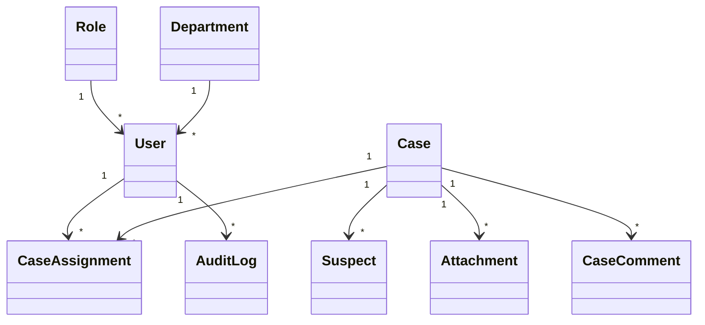

# 10 - Business Domain Model

---

| Élément                  | Valeur                               |
| ------------------------ | ------------------------------------ |
| **Document**             | 10-Business-Domain-Model.md          |
| **Projet**               | Police Case Management System (PCMS) |
| **Version**              | 1.0.0                                |
| **Statut**               | Draft                                |
| **Auteur**               | Équipe Projet PCMS                   |
| **Dernière mise à jour** | 29/07/2026                           |

---

# Table des matières

1. Objectif
2. Vue d'ensemble
3. Principes de conception
4. Entités métier
5. Diagramme métier
6. Relations entre les entités
7. Énumérations
8. Choix de modélisation
9. Évolutions prévues
10. Bénéfices du modèle
11. Documents associés
12. Historique des révisions

---

# 1. Objectif

Ce document décrit le **Business Domain Model** du **Police Case Management System (PCMS)**.

Il définit les principales entités métier, leurs responsabilités et leurs relations.

Le modèle métier constitue la base de :

* l'architecture logicielle ;
* la conception de la base PostgreSQL ;
* l'implémentation des entités JPA ;
* la définition des règles métier.

---

# 2. Vue d'ensemble

Le modèle métier du PCMS est conçu pour représenter fidèlement le fonctionnement d'un service de police.

Il permet notamment :

* la gestion des utilisateurs et de leurs rôles ;
* l'organisation par département ;
* la gestion des dossiers d'enquête ;
* l'affectation de plusieurs enquêteurs à un même dossier ;
* la gestion des suspects ;
* la gestion des pièces jointes ;
* le suivi des commentaires ;
* l'historisation des actions.

Le modèle privilégie l'évolutivité afin de faciliter l'ajout de nouvelles fonctionnalités.

---

# 3. Principes de conception

Les principes suivants ont guidé la modélisation :

* séparation des responsabilités ;
* normalisation des données ;
* limitation des duplications ;
* évolutivité du modèle ;
* prise en charge des relations multiples ;
* conservation de l'historique métier.

---

# 4. Entités métier

## User

Représente un utilisateur de l'application.

Responsabilités :

* authentification ;
* consultation des dossiers ;
* création et mise à jour des dossiers ;
* participation aux enquêtes.

---

## Role

Décrit le rôle attribué à un utilisateur.

Un rôle peut être partagé par plusieurs utilisateurs.

---

## Department

Représente une unité ou un département de police.

Cette entité permet notamment :

* d'affecter les utilisateurs à une unité ;
* de filtrer les dossiers ;
* de produire des statistiques par département ;
* de préparer une gestion plus fine des autorisations.

---

## Case

Représente un dossier d'enquête.

Il constitue l'entité centrale du système.

---

## CaseAssignment

Entité d'association entre **Case** et **User**.

Elle permet :

* d'affecter plusieurs utilisateurs à un dossier ;
* de conserver l'historique des affectations ;
* d'indiquer la date d'affectation ;
* d'identifier l'utilisateur ayant réalisé l'affectation ;
* de gérer l'état actif ou non d'une affectation.

Attributs principaux :

* id
* assignedAt
* assignedBy
* active

---

## Suspect

Représente un suspect lié à un dossier.

Dans le MVP, seul le rôle **Suspect** est modélisé.

---

## Attachment

Représente une pièce jointe associée à un dossier.

Exemples :

* photographie ;
* vidéo ;
* rapport ;
* document PDF.

---

## CaseComment

Représente un commentaire associé à un dossier.

---

## AuditLog

Historise les actions réalisées par les utilisateurs.

Il permet la traçabilité des opérations effectuées dans le système.

---

# 5. Diagramme métier

Le diagramme met en évidence les principales relations du domaine métier.

---

# 6. Relations entre les entités

| Relation              | Cardinalité | Description                                              |
| --------------------- | ----------- | -------------------------------------------------------- |
| Role → User           | 1 → *       | Un rôle peut être attribué à plusieurs utilisateurs      |
| Department → User     | 1 → *       | Un département regroupe plusieurs utilisateurs           |
| Case → CaseAssignment | 1 → *       | Un dossier peut avoir plusieurs affectations             |
| User → CaseAssignment | 1 → *       | Un utilisateur peut être affecté à plusieurs dossiers    |
| Case → Suspect        | 1 → *       | Un dossier peut concerner plusieurs suspects             |
| Case → Attachment     | 1 → *       | Un dossier peut contenir plusieurs pièces jointes        |
| Case → CaseComment    | 1 → *       | Un dossier peut recevoir plusieurs commentaires          |
| User → AuditLog       | 1 → *       | Un utilisateur peut générer plusieurs événements d'audit |

---

# 7. Énumérations

## CaseStatus

Les statuts possibles d'un dossier sont :

* OPEN
* IN_PROGRESS
* ON_HOLD
* CLOSED
* ARCHIVED

L'utilisation d'une énumération garantit des valeurs contrôlées et évite les erreurs de saisie.

---

## Priority

Les niveaux de priorité sont :

* LOW
* MEDIUM
* HIGH
* CRITICAL

---

## AttachmentType

Les types de pièces jointes pris en charge sont :

* PHOTO
* VIDEO
* PDF
* REPORT

---

# 8. Choix de modélisation

## Pourquoi créer `Department` ?

L'introduction de cette entité permet :

* l'organisation des utilisateurs par unité ;
* le filtrage des dossiers par département ;
* la production de statistiques ;
* la préparation d'une gestion avancée des autorisations.

---

## Pourquoi créer `CaseAssignment` ?

Une relation directe entre **Case** et **User** ne permettrait d'affecter qu'un seul responsable à un dossier.

L'entité **CaseAssignment** offre une solution plus souple :

* plusieurs enquêteurs peuvent être affectés au même dossier ;
* l'historique des affectations est conservé ;
* les changements d'affectation sont tracés.

---

## Pourquoi utiliser des énumérations ?

Les énumérations :

* limitent les valeurs autorisées ;
* réduisent les erreurs ;
* améliorent la lisibilité du code ;
* facilitent la maintenance.

---

# 9. Évolutions prévues

Le modèle est conçu pour évoluer.

Une évolution identifiée consiste à introduire une entité **Person** regroupant différents rôles :

* Suspect ;
* Victim ;
* Witness.

Afin de limiter la complexité du MVP, seule l'entité **Suspect** est conservée dans la première version.

---

# 10. Bénéfices du modèle

Le modèle métier retenu présente plusieurs avantages :

* prise en charge de plusieurs enquêteurs par dossier ;
* historisation des affectations ;
* organisation par département ;
* séparation des rôles et des utilisateurs ;
* préparation des évolutions futures ;
* meilleure adéquation avec les besoins métier.

---

# 11. Documents associés

| Document                   | Description                 |
| -------------------------- | --------------------------- |
| 03-Business-Rules.md       | Règles métier               |
| 05-System-Architecture.md  | Architecture générale       |
| 08-C4-Components.md        | Architecture des composants |
| 09-Repository-Structure.md | Organisation du dépôt       |
| 11-Database.md             | Modèle de données physique  |
| 12-Security.md             | Architecture de sécurité    |

---

# 12. Historique des révisions

| Version | Date       | Auteur             | Description          |
| ------- | ---------- | ------------------ | -------------------- |
| 1.0.0   | 29/07/2026 | Équipe Projet PCMS | Création du document |

