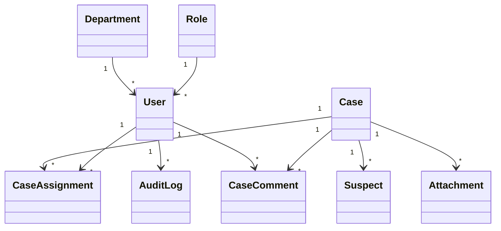

# 01 - Conceptual Data Model (CDM)

---

| Élément                  | Valeur                               |
| ------------------------ | ------------------------------------ |
| **Document**             | 01-Conceptual-Data-Model.md          |
| **Emplacement**          | `docs/database/`                     |
| **Projet**               | Police Case Management System (PCMS) |
| **Version**              | 1.0.0                                |
| **Statut**               | Draft                                |
| **Auteur**               | Équipe Projet PCMS                   |
| **Dernière mise à jour** | 29/07/2026                           |

---

# Table des matières

1. Objectif
2. Qu'est-ce qu'un Conceptual Data Model ?
3. Principes de modélisation
4. Entités métier
5. Attributs métier
6. Relations conceptuelles
7. Diagramme conceptuel
8. Cardinalités
9. Validation du modèle
10. Évolutions futures
11. Principes de conception
12. Documents associés
13. Historique des révisions

---

# 1. Objectif

Ce document définit le **Conceptual Data Model (CDM)** du **Police Case Management System (PCMS)**.

Le CDM décrit les données manipulées par le métier indépendamment de toute technologie.

Il constitue la référence officielle pour :

* le modèle logique de données (LDM) ;
* le diagramme Entité-Relation (ERD) ;
* le schéma PostgreSQL ;
* les entités JPA ;
* les repositories Spring Data.

---

# 2. Qu'est-ce qu'un Conceptual Data Model ?

Le modèle conceptuel répond à trois questions fondamentales :

* Quelles sont les entités métier ?
* Quelles informations portent-elles ?
* Comment sont-elles liées ?

À ce niveau de conception, aucune notion de :

* type SQL ;
* clé étrangère ;
* index ;
* contrainte PostgreSQL ;

n'est introduite.

Le modèle reste entièrement indépendant de la technologie.

---

# 3. Principes de modélisation

Le CDM est construit selon les principes suivants :

* représentation fidèle du métier ;
* indépendance vis-à-vis du SGBD ;
* séparation des responsabilités ;
* extensibilité ;
* préparation à la normalisation.

Chaque entité représente un concept métier unique.

---

# 4. Entités métier

Le MVP du PCMS repose sur les neuf entités suivantes.

| Entité             | Description                                |
| ------------------ | ------------------------------------------ |
| **User**           | Utilisateur du système                     |
| **Role**           | Rôle fonctionnel attribué à un utilisateur |
| **Department**     | Département ou unité de police             |
| **Case**           | Dossier d'enquête                          |
| **CaseAssignment** | Affectation d'un utilisateur à un dossier  |
| **Suspect**        | Suspect associé à une enquête              |
| **Attachment**     | Pièce jointe d'un dossier                  |
| **CaseComment**    | Commentaire d'enquête                      |
| **AuditLog**       | Journal des opérations importantes         |

Ces entités couvrent les besoins fonctionnels identifiés durant la phase d'analyse.

---

# 5. Attributs métier

Les attributs décrits ci-dessous représentent les informations métier principales.

Aucun type SQL n'est encore défini.

## User

* id
* firstName
* lastName
* email
* password
* enabled
* createdAt

---

## Role

* id
* name
* description

---

## Department

* id
* code
* name

---

## Case

* id
* title
* description
* status
* priority
* createdAt
* updatedAt

> **Note**
>
> Le numéro métier (`caseNumber`) n'est volontairement pas présent dans cette première version.
>
> Il sera introduit ultérieurement afin de gérer une numérotation fonctionnelle (par exemple : `PCMS-2026-000001`) distincte de l'identifiant technique.

---

## CaseAssignment

* id
* assignedAt
* active

---

## Suspect

* id
* firstName
* lastName
* birthDate

---

## Attachment

* id
* filename
* type
* uploadedAt

---

## CaseComment

* id
* content
* createdAt

---

## AuditLog

* id
* action
* timestamp

---

# 6. Relations conceptuelles

Le modèle conceptuel définit les relations suivantes.

| Entité A   | Relation | Entité B       | Description                                           |
| ---------- | -------- | -------------- | ----------------------------------------------------- |
| Role       | 1 → N    | User           | Un rôle peut être attribué à plusieurs utilisateurs   |
| Department | 1 → N    | User           | Un département regroupe plusieurs utilisateurs        |
| User       | 1 → N    | CaseAssignment | Un utilisateur peut être affecté à plusieurs dossiers |
| Case       | 1 → N    | CaseAssignment | Un dossier peut posséder plusieurs affectations       |
| Case       | 1 → N    | Suspect        | Une enquête peut concerner plusieurs suspects         |
| Case       | 1 → N    | Attachment     | Une enquête peut contenir plusieurs pièces jointes    |
| Case       | 1 → N    | CaseComment    | Une enquête peut recevoir plusieurs commentaires      |
| User       | 1 → N    | CaseComment    | Chaque commentaire possède un auteur                  |
| User       | 1 → N    | AuditLog       | Chaque opération est associée à un utilisateur        |

---

# 7. Diagramme conceptuel

Le recours à l'entité **CaseAssignment** permet de modéliser proprement la relation **Many-to-Many** entre **User** et **Case**, tout en conservant les informations métier propres à une affectation (date, état actif).

---

# 8. Cardinalités

Les cardinalités retenues au niveau conceptuel sont les suivantes.

| Relation              | Cardinalité |
| --------------------- | ----------- |
| Role → User           | 1 → N       |
| Department → User     | 1 → N       |
| User → CaseAssignment | 0 → N       |
| Case → CaseAssignment | 1 → N       |
| Case → Suspect        | 0 → N       |
| Case → Attachment     | 0 → N       |
| Case → CaseComment    | 0 → N       |
| User → CaseComment    | 1 → N       |
| User → AuditLog       | 1 → N       |

Les cardinalités seront précisées et traduites en clés primaires et étrangères dans le **Logical Data Model (LDM)**.

---

# 9. Validation du modèle

Le modèle permet de représenter l'ensemble des règles métier identifiées durant la phase d'analyse.

| Règle métier                     | Entité concernée |
| -------------------------------- | ---------------- |
| Plusieurs enquêteurs par dossier | CaseAssignment   |
| Historique des opérations        | AuditLog         |
| Commentaires d'enquête           | CaseComment      |
| Pièces jointes                   | Attachment       |
| Organisation des utilisateurs    | Department       |
| Gestion des rôles                | Role             |

Chaque besoin métier trouve ainsi une représentation dans le modèle conceptuel.

---

# 10. Évolutions futures

Le modèle est conçu pour être extensible.

Les versions futures pourront notamment intégrer les entités suivantes :

* Victim
* Witness
* Evidence
* Vehicle
* Weapon
* Location
* Organization

Ces ajouts pourront être réalisés sans remettre en cause les fondations actuelles du modèle.

---

# 11. Principes de conception

Le CDM respecte les principes suivants :

* indépendant de toute technologie ;
* centré sur le métier ;
* facilement extensible ;
* compatible avec la normalisation ;
* prêt à être transformé en modèle logique.

---

# 12. Documents associés

| Document                           | Description                                        |
| ---------------------------------- | -------------------------------------------------- |
| 00-Database-Design-Introduction.md | Introduction à la conception de la base de données |
| 10-Business-Domain-Model.md        | Modèle métier                                      |
| 03-Business-Rules.md               | Règles métier                                      |
| 02-Logical-Data-Model.md           | Modèle logique de données *(à venir)*              |
| 03-Entity-Relationship-Diagram.md  | Diagramme ERD *(à venir)*                          |

---

# 13. Historique des révisions

| Version | Date       | Auteur             | Description          |
| ------- | ---------- | ------------------ | -------------------- |
| 1.0.0   | 29/07/2026 | Équipe Projet PCMS | Création du document |

