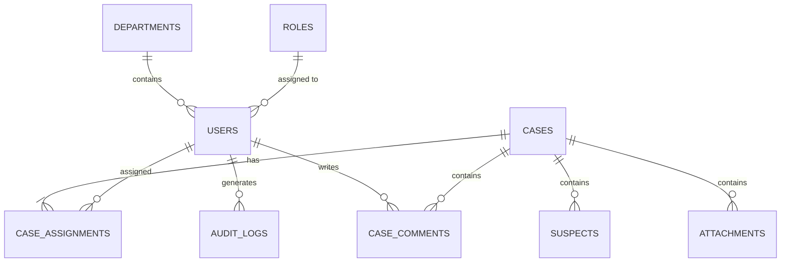

# 04 - Entity Relationship Diagram (ERD)

---

| Élément                  | Valeur                               |
| ------------------------ | ------------------------------------ |
| **Document**             | 04-Entity-Relationship-Diagram.md    |
| **Emplacement**          | `docs/database/`                     |
| **Projet**               | Police Case Management System (PCMS) |
| **Version**              | 1.0.0                                |
| **Statut**               | Draft                                |
| **Auteur**               | Équipe Projet PCMS                   |
| **Dernière mise à jour** | 30/07/2026                           |

---

# Table des matières

1. Objectif
2. Qu'est-ce qu'un ERD ?
3. Vue d'ensemble
4. Diagramme Entité-Relation
5. Description des relations
6. Cardinalités
7. Entité d'association
8. Validation du modèle
9. Préparation du schéma physique
10. Documents associés
11. Historique des révisions

---

# 1. Objectif

Ce document présente le **Entity Relationship Diagram (ERD)** du **Police Case Management System (PCMS)**.

L'ERD représente graphiquement la structure logique de la base de données.

Il constitue la référence officielle pour :

* le schéma PostgreSQL ;
* les entités JPA/Hibernate ;
* les migrations Flyway ;
* les repositories Spring Data ;
* les futures évolutions de la base de données.

---

# 2. Qu'est-ce qu'un ERD ?

L'Entity Relationship Diagram est la représentation graphique du **Logical Data Model (LDM)**.

Il montre :

* les entités ;
* leurs attributs principaux ;
* les relations ;
* les cardinalités.

À ce stade, les types SQL détaillés ne sont pas encore représentés.

---

# 3. Vue d'ensemble

Le modèle de données du PCMS repose sur les entités suivantes :

* Role
* Department
* User
* Case
* CaseAssignment
* Suspect
* Attachment
* CaseComment
* AuditLog

Toutes ces entités proviennent directement du **Business Domain Model** et du **Conceptual Data Model**.

---

# 4. Diagramme Entité-Relation

---

# 5. Description des relations

| Relation              | Cardinalité | Description                                           |
| --------------------- | ----------- | ----------------------------------------------------- |
| Role → User           | 1 → N       | Un rôle peut être attribué à plusieurs utilisateurs   |
| Department → User     | 1 → N       | Un département regroupe plusieurs utilisateurs        |
| User → CaseAssignment | 0 → N       | Un utilisateur peut être affecté à plusieurs dossiers |
| Case → CaseAssignment | 1 → N       | Un dossier possède au moins une affectation active    |
| Case → Suspect        | 0 → N       | Un dossier peut concerner plusieurs suspects          |
| Case → Attachment     | 0 → N       | Un dossier peut contenir plusieurs pièces jointes     |
| Case → CaseComment    | 0 → N       | Un dossier peut recevoir plusieurs commentaires       |
| User → CaseComment    | 1 → N       | Chaque commentaire possède un auteur                  |
| User → AuditLog       | 1 → N       | Chaque opération est associée à un utilisateur        |

---

# 6. Cardinalités

Les cardinalités utilisées dans le modèle sont résumées ci-dessous.

| Cardinalité | Signification                 |
| ----------- | ----------------------------- |
| **1..1**    | Une seule occurrence          |
| **0..1**    | Relation optionnelle          |
| **1..N**    | Une ou plusieurs occurrences  |
| **0..N**    | Zéro ou plusieurs occurrences |

Ces cardinalités traduisent directement les règles métier définies dans le document **03-Business-Rules.md**.

---

# 7. Entité d'association

Le modèle introduit l'entité **CaseAssignment** afin de représenter la relation entre les utilisateurs et les dossiers.

Cette approche présente plusieurs avantages :

* gestion de plusieurs enquêteurs pour une même enquête ;
* conservation de l'historique des affectations ;
* possibilité de désactiver une affectation sans la supprimer ;
* stockage d'informations propres à l'affectation (`assignedAt`, `active`).

Cette entité remplace avantageusement une simple relation Many-to-Many.

---

# 8. Validation du modèle

L'ERD permet de représenter l'ensemble des règles métier identifiées lors de la phase d'analyse.

| Fonctionnalité                    | Entité principale |
| --------------------------------- | ----------------- |
| Gestion des utilisateurs          | User              |
| Gestion des rôles                 | Role              |
| Organisation des départements     | Department        |
| Gestion des dossiers              | Case              |
| Affectation des enquêteurs        | CaseAssignment    |
| Gestion des suspects              | Suspect           |
| Gestion des preuves documentaires | Attachment        |
| Journal des commentaires          | CaseComment       |
| Traçabilité des opérations        | AuditLog          |

Le modèle couvre l'ensemble du périmètre fonctionnel du MVP.

---

# 9. Préparation du schéma physique

L'ERD constitue la dernière étape de conception avant la définition du modèle physique PostgreSQL.

Les chapitres suivants introduiront notamment :

* les types SQL ;
* les contraintes d'intégrité ;
* les index ;
* les règles de normalisation ;
* les conventions de nommage ;
* les scripts de migration Flyway.

---

# 10. Documents associés

| Document                           | Description                      |
| ---------------------------------- | -------------------------------- |
| 00-Database-Design-Introduction.md | Introduction à la conception     |
| 01-Conceptual-Data-Model.md        | Modèle conceptuel                |
| 02-Base-Entity-and-Audit.md        | Entité de base et audit          |
| 03-Logical-Data-Model.md           | Modèle logique                   |
| 05-Normalization.md                | Normalisation *(à venir)*        |
| 06-Constraints-and-Indexes.md      | Contraintes et index *(à venir)* |

---

# 11. Historique des révisions

| Version | Date       | Auteur             | Description          |
| ------- | ---------- | ------------------ | -------------------- |
| 1.0.0   | 30/07/2026 | Équipe Projet PCMS | Création du document |

